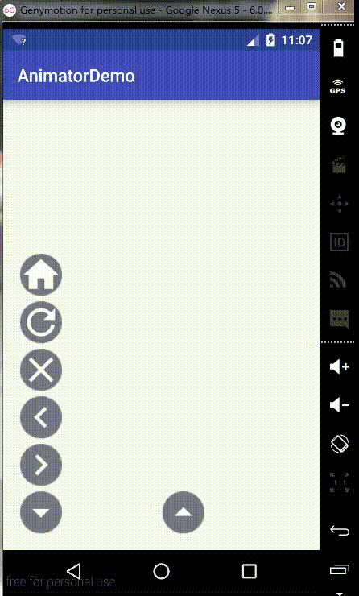
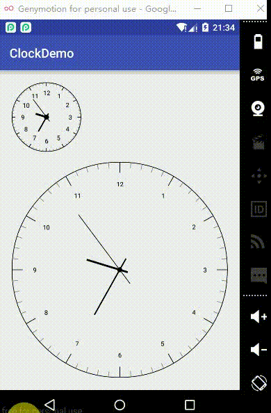
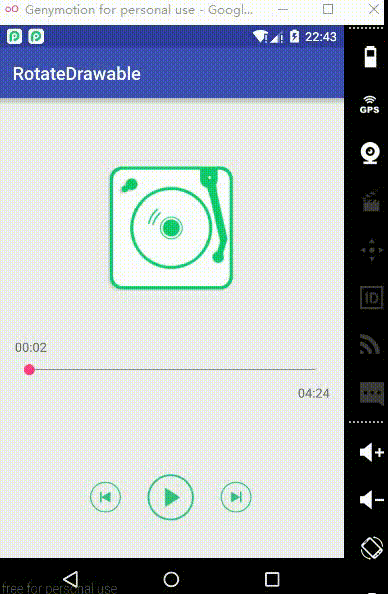

#1、[AnimatorDemo](https://github.com/woshidasusu/DasusuDemo/tree/master/AnimatorDemo)  
这demo主要是涉及到属性动画的知识点，为了更好的学习属性动画，该demo在实现一些动画效果上，分别选择**ObjectAnimator**、**ValueAnimator** 来实现，实现方式也尝试了**xml静态实现**、**java动态实现**两种方式。  

#2、[ClockDemo](https://github.com/woshidasusu/DasusuDemo/tree/master/ClockDemo)  
这个demo是一个基本的自定义view的学习  

  

#3、[ToolbarDemo](https://github.com/woshidasusu/DasusuDemo/tree/master/ToolbarDemo)  
这个demo是学习Android 5.0提供了酷炫标题栏效果，涉及的知识点：**AppBarLayout+CollapsingToolbarLayout+Toolbar**

  

#4、[RotateDrawable](https://github.com/woshidasusu/DasusuDemo/tree/master/RotateDrawable)  
这个demo学习媒体文件播放，**MediaPlayer**的使用，以及利用属性动画实现TextView的平移，利用补间动画实现碟片及播放杆的旋转。  

  

#5、[WhiteBoardDemo](https://github.com/woshidasusu/DasusuDemo/tree/master/WhiteBoardDemo)  
这是一个白板demo，类似于画图工具一样，提供一张白纸，可以上面画画、写字、缩放、移动、以及多设备协作等功能。  
主要涉及的知识点是手势的获取、判断及处理，比如有滑动手势，有缩放手势，有单指，有双指等，这些都需要自己来进行处理相关操作。 

  

#6、[OpenRTSPDemo](https://github.com/woshidasusu/DasusuDemo/tree/master/OpenRTSPDemo)
这个demo是利用openRtsp提供的api，对一些网上在线测试RTSP视频流进行录像，并保存成视频文件的功能。  
demo主要涉及到的知识点有：调用shell命令执行二进制可执行文件、以及类似文件管理界面  

