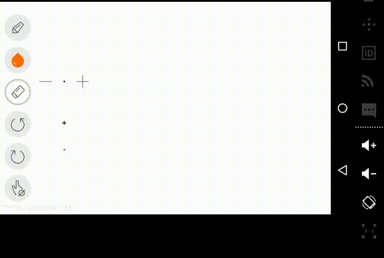

#WhiteboardDemo  

这是一个白板demo，类似于画图工具一样，提供一张白纸，可以上面画画、写字、缩放、移动等功能。  
主要涉及的知识点是手势的获取、判断及处理，比如有滑动手势，有缩放手势，有单指，有双指等，这些都需要自己来进行处理相关操作。  
另外，该demo还尝试简单的实现了共享白板，即不同设备间同步画板内容，但这需要通过服务器来转发数据，维持一个Socket连接。  
最后声明，该demo参考自github上另一大神的开源项目，因为当初学习时并没有做总结笔记，现在已经忘记参考的项目地址是什么了，但还是要感谢下大神。  

#效果  

  

  

